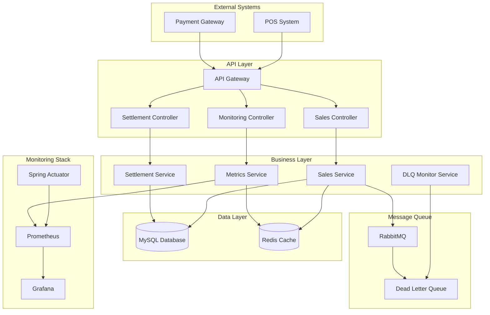

# 🏪 Mini Today Sales

[](https://spring.io/projects/spring-boot)
[](https://openjdk.java.net/)
[](https://www.mysql.com/)
[](https://redis.io/)
[](https://www.rabbitmq.com/)

> **실시간 매출 관리 및 모니터링 시스템**
>
> POS 시스템과 연동하여 매출 데이터를 실시간으로 수집, 처리, 분석하는 마이크로서비스 아키텍처 기반의 현대적인 매출 관리 솔루션입니다.

## 📋 목차

- [프로젝트 개요](#-프로젝트-개요)
- [핵심 기능](#-핵심-기능)
- [시스템 아키텍처](#-시스템-아키텍처)
- [기술 스택](#-기술-스택)
- [빠른 시작](#-빠른-시작)
- [API 사용 예시](#-api-사용-예시)
- [성능 메트릭](#-성능-메트릭)
- [모니터링](#-모니터링)
- [개발 환경](#-개발-환경)
- [기여하기](#-기여하기)

## 🎯 프로젝트 개요

Mini Today Sales는 중소 규모 매장을 위한 실시간 매출 관리 시스템으로, 다음과 같은 비즈니스 요구사항을 해결합니다:

- **실시간 매출 추적**: POS 시스템에서 발생하는 매출 데이터를 실시간으로 수집
- **자동 정산 처리**: 일일/월별 자동 정산 및 수수료 계산
- **통합 대시보드**: 직관적인 매출 분석 및 리포팅
- **시스템 모니터링**: 실시간 시스템 상태 및 성능 모니터링

## ✨ 핵심 기능

### 🔄 매출 데이터 처리
- **Webhook 기반 매출 수신**: 외부 POS 시스템과의 실시간 연동
- **다중 결제 수단 지원**: 카드, 현금, 간편결제 등
- **채널별 매출 관리**: 온라인/오프라인 채널 구분

### 📊 실시간 대시보드
- **일일 매출 현황**: 실시간 매출 통계 및 트렌드
- **시간대별 분석**: 매시간 매출 패턴 분석
- **결제 수단별 통계**: 결제 유형별 상세 분석

### 💰 자동 정산 시스템
- **일일 정산**: 매일 자정 자동 정산 처리
- **수수료 계산**: 결제 수단별 차등 수수료 적용
- **정산 내역 관리**: 정산 이력 및 상태 추적

### 📈 종합 모니터링
- **Prometheus 메트릭**: 비즈니스 및 시스템 메트릭 수집
- **Spring Actuator**: 애플리케이션 상태 모니터링
- **DLQ 모니터링**: 실패한 메시지 추적 및 재처리

## 🏗️ 시스템 아키텍처



## 🛠️ 기술 스택

### Backend
- **Framework**: Spring Boot 2.7.18
- **Language**: Java 11
- **Build Tool**: Maven 3.8+

### Database & Cache
- **Database**: MySQL 8.0
- **Cache**: Redis 7.0
- **ORM**: Spring Data JPA + Hibernate

### Message Queue
- **Broker**: RabbitMQ 3.12
- **Pattern**: Producer-Consumer, DLQ

### Monitoring & Observability
- **Metrics**: Micrometer + Prometheus
- **Health Check**: Spring Actuator
- **Documentation**: OpenAPI 3.0 (Swagger)

### Testing
- **Unit Test**: JUnit 5
- **Integration Test**: TestContainers
- **Test Database**: H2 (Unit), MySQL (Integration)

## 🚀 빠른 시작

### 사전 요구사항

```bash
# Java 11+ 설치 확인
java -version

# Maven 3.8+ 설치 확인
mvn -version

# Docker 설치 확인 (선택사항)
docker --version
```

### 로컬 개발 환경 설정

1. **프로젝트 클론**
```bash
git clone https://github.com/your-org/mini-today-sales.git
cd mini-today-sales
```

2. **외부 의존성 실행 (Docker Compose)**
```bash
# MySQL, Redis, RabbitMQ 실행
docker-compose up -d
```

3. **애플리케이션 빌드 및 실행**
```bash
# 빌드
mvn clean compile

# 테스트 실행
mvn test

# 애플리케이션 실행
mvn spring-boot:run
```

4. **서비스 확인**
```bash
# API 문서 확인
curl http://localhost:8080/swagger-ui/index.html

# Health Check
curl http://localhost:8080/actuator/health

# Prometheus 메트릭
curl http://localhost:8080/actuator/prometheus
```

### 환경별 설정

#### 개발 환경 (application-dev.yml)
```yaml
spring:
  profiles: dev
  datasource:
    url: jdbc:mysql://localhost:3306/today_sales_dev
  redis:
    host: localhost
    port: 6379
  rabbitmq:
    host: localhost
    port: 5672
```

#### 운영 환경 (application-prod.yml)
```yaml
spring:
  profiles: prod
  datasource:
    url: ${DB_URL}
    username: ${DB_USERNAME}
    password: ${DB_PASSWORD}
  redis:
    host: ${REDIS_HOST}
    port: ${REDIS_PORT}
```

## 🔧 API 사용 예시

### 매출 등록

```bash
# 매출 데이터 등록
curl -X POST http://localhost:8080/api/v1/sales/webhook \
  -H "Content-Type: application/json" \
  -d '{
    "businessNumber": "123-45-67890",
    "transactionTime": "2024-01-15T14:30:00",
    "amount": 25000,
    "paymentType": "CARD",
    "channel": "ONLINE",
    "orderNumber": "ORDER-20240115-001"
  }'
```

**응답:**
```json
{
  "success": true,
  "message": "매출이 성공적으로 등록되었습니다",
  "data": {
    "id": 1,
    "amount": 25000,
    "paymentType": "CARD",
    "channel": "ONLINE",
    "orderNumber": "ORDER-20240115-001",
    "createdAt": "2024-01-15T14:30:00"
  }
}
```

### 대시보드 조회

```bash
# 일일 대시보드 조회
curl "http://localhost:8080/api/v1/sales/dashboard/123-45-67890?date=2024-01-15"
```

**응답:**
```json
{
  "success": true,
  "data": {
    "date": "2024-01-15",
    "totalAmount": 125000,
    "totalCount": 15,
    "paymentTypeStatistics": [
      {
        "paymentType": "CARD",
        "amount": 100000,
        "count": 12,
        "fee": 2000,
        "netAmount": 98000
      }
    ],
    "hourlyStatistics": [
      {
        "hour": 14,
        "amount": 25000,
        "count": 3
      }
    ]
  }
}
```

### 월별 리포트

```bash
# 월별 리포트 조회
curl "http://localhost:8080/api/v1/sales/report/monthly/123-45-67890?yearMonth=2024-01"
```

## 📊 성능 메트릭

### 응답 시간 목표
- **매출 등록 API**: < 100ms (P95)
- **대시보드 조회**: < 200ms (P95)
- **리포트 생성**: < 500ms (P95)

### 처리량 목표
- **매출 등록**: 1,000 TPS
- **조회 API**: 5,000 TPS
- **정산 처리**: 10,000 건/분

### 시스템 리소스
- **CPU 사용률**: < 70%
- **메모리 사용률**: < 80%
- **DB 커넥션**: 최대 20개

### 주요 메트릭

```bash
# 매출 관련 메트릭
sales_created_total
sales_amount_total
sales_processing_duration_seconds

# 시스템 메트릭
jvm_memory_used_bytes
jvm_gc_collection_seconds
http_requests_total

# 비즈니스 메트릭
daily_settlement_amount
payment_type_distribution
```

## 🔍 모니터링

### Health Check 엔드포인트

```bash
# 전체 상태 확인
curl http://localhost:8080/actuator/health

# 데이터베이스 상태
curl http://localhost:8080/actuator/health/db

# Redis 상태
curl http://localhost:8080/actuator/health/redis

# RabbitMQ 상태
curl http://localhost:8080/actuator/health/rabbit
```

### 커스텀 모니터링

```bash
# 시스템 정보
curl http://localhost:8080/api/monitoring/system/info

# 메트릭 요약
curl http://localhost:8080/api/monitoring/metrics/summary

# DLQ 모니터링
curl http://localhost:8080/api/monitoring/dlq/status
```

### Grafana 대시보드

1. **매출 대시보드**: 실시간 매출 현황 및 트렌드
2. **시스템 대시보드**: JVM, DB, 캐시 성능 모니터링
3. **비즈니스 대시보드**: 정산, 수수료, ROI 분석

## 🧪 개발 환경

### 테스트 실행

```bash
# 전체 테스트
mvn test

# 통합 테스트만 실행
mvn test -Dtest="*IntegrationTest"

# 특정 테스트 클래스
mvn test -Dtest=SimpleIntegrationTest
```

### 코드 품질 확인

```bash
# 정적 분석
mvn spotbugs:check

# 코드 포맷팅
mvn spring-javaformat:apply

# 의존성 분석
mvn dependency:analyze
```

### 프로파일링

```bash
# 개발 환경으로 실행
mvn spring-boot:run -Dspring-boot.run.profiles=dev

# 디버그 모드
mvn spring-boot:run -Dspring-boot.run.jvmArguments="-Xdebug -Xrunjdwp:transport=dt_socket,server=y,suspend=n,address=5005"
```

## 📁 프로젝트 구조

```
mini-today-sales/
├── src/
│   ├── main/
│   │   ├── java/com/okpos/todaysales/
│   │   │   ├── controller/          # REST API 컨트롤러
│   │   │   ├── service/             # 비즈니스 로직
│   │   │   ├── repository/          # 데이터 접근 계층
│   │   │   ├── entity/              # JPA 엔티티
│   │   │   ├── dto/                 # 데이터 전송 객체
│   │   │   ├── config/              # 설정 클래스
│   │   │   └── listener/            # 이벤트 리스너
│   │   └── resources/
│   │       ├── application.yml      # 기본 설정
│   │       ├── application-dev.yml  # 개발 환경 설정
│   │       └── application-prod.yml # 운영 환경 설정
│   └── test/
│       ├── java/                    # 테스트 코드
│       └── resources/               # 테스트 리소스
├── docs/                            # 문서
├── docker-compose.yml               # 로컬 개발 환경
├── Dockerfile                       # 컨테이너 이미지
└── pom.xml                         # Maven 설정
```

## 🤝 기여하기

프로젝트에 기여해주셔서 감사합니다! 자세한 내용은 [CONTRIBUTING.md](CONTRIBUTING.md)를 참고해주세요.

### 주요 기여 가이드라인

1. **이슈 생성**: 버그 리포트나 기능 제안은 GitHub Issues를 활용해주세요
2. **브랜치 전략**: `feature/기능명` 또는 `fix/버그명` 형태로 브랜치를 생성해주세요
3. **커밋 메시지**: [Conventional Commits](https://www.conventionalcommits.org/) 규칙을 따라주세요
4. **테스트**: 새로운 기능이나 버그 수정 시 반드시 테스트 코드를 작성해주세요
5. **문서화**: API 변경 시 관련 문서를 함께 업데이트해주세요

## 📄 라이선스

이 프로젝트는 MIT 라이선스 하에 배포됩니다. 자세한 내용은 [LICENSE](LICENSE) 파일을 참고해주세요.

## 📞 지원 및 문의

- **이슈 리포팅**: [GitHub Issues](https://github.com/your-org/mini-today-sales/issues)
- **기능 제안**: [GitHub Discussions](https://github.com/your-org/mini-today-sales/discussions)
- **보안 취약점**: security@yourcompany.com

---

**Mini Today Sales** - *Modern Sales Management System* 🚀